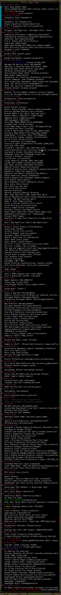

# Cataclysm DDA mod pack
Anubioz personal modpack for **LATEST** **Experimental** builds of Cataclysm DDA by CleverRaven: https://github.com/CleverRaven/Cataclysm-DDA/

**This modpack is largely based on works of Chromosome Kun, [Kenan2000](https://github.com/Kenan2000/CDDA-Kenan-Modpack) and [GMC-modding team](https://github.com/GMC-Modding-Team/Community-Mod-Compilation-redux)**
**Without your awesome packs this one would be impossible!**

**IF YOU ARE EXPERIENCING ANY BUGS OR ERRORS - PLEASE OPEN AN ISSUE**

This mod is confirmed to load without issues work with: [Cataclysm-DDA experimental build 2021-10-02-1005](https://github.com/CleverRaven/Cataclysm-DDA/releases/tag/cdda-experimental-2021-10-02-1005)

# Installation Guide (MUST-READ)

1. Download and install latest release of CataclysmDDA by **ClearRaven** - [*CataclysmDDA*](https://github.com/CleverRaven/Cataclysm-DDA/releases)
2. Download and install latest git version
3. Go to your game `data` folder
4. move the "mods" directory somewhere out of it (i.e. with a command `mv mods ../../`)
5. `git clone https://github.com/Anubioz/CataclysmDDA-Mod-Pack-2021 mods`
6. move back the contents of your mods folder without overwriting (eg. with a command `mv ../../mods/* mods/`)
7. Launch Cataclysm
8. Create a new World, remove all mods from the right side
9. Find "!!! 1. ADD THIS" entry from the left
10. Add it
11. Enjoy the mods!

# Modpack UPDATE Guide

1. Go to your mods folder
2. git pull
3. You're all set!

